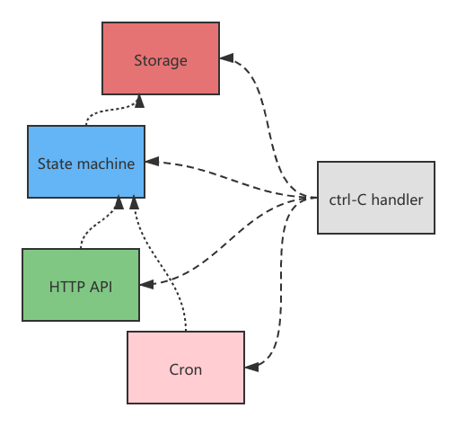

## 标准库 context 包

标准库的 context 包中主要就是几种控制 goroutine 生命周期的方法：

- `WithCancel`: 手动控制结束
- `WithTimeout`: 指定超时时间后结束
- `WithDeadline`: 指定时间结束

下面的样例演示了生成特定随机数后**手动结束** goroutine 的操作，它会随机打印几次 "running..."

```go
package main

import (
	"context"
	"fmt"
	"math/rand"
	"sync"
	"time"
)

func main() {
	rand.Seed(time.Now().UnixNano())
	ctx, cancel := context.WithCancel(context.Background())

	var wg sync.WaitGroup
	wg.Add(1)

	go func(ctx context.Context) {
		defer wg.Done()
		for {
			select {
			default:
				time.Sleep(time.Second)
				fmt.Println("running...")
			case <-ctx.Done():
				fmt.Println("done")
				return
			}
		}
	}(ctx)

	for {
		time.Sleep(time.Second)
		if rand.Intn(10) < 3 {
			cancel()
			break
		}
	}

	wg.Wait()
}
```

需要注意的是，context 并不能直接让 goroutine 结束，真正让 goroutine 结束的是它自己。通过 select 语句中的 `case <-ctx.Done()` 接收到了 `cancel()` 发出的“通知”，然后作出相应的结束操作。（事实上它完全可以选择不听 context 的）

如果情况复杂些，子 goroutine 又 go 了个孙子 goroutine，控制它们的生命周期只需要把 `ctx` 一直传下去即可，所有 goroutine 组成的结构就像一棵从 `context.Background()` 展开的树。

```go
package main

import (
	"context"
	"fmt"
	"sync"
	"time"
)

var wg sync.WaitGroup

func main() {
	ctx, cancel := context.WithTimeout(context.Background(), 3*time.Second)
	defer cancel()

	wg.Add(1)
	go worker1(ctx)

	wg.Wait()
}

func worker1(ctx context.Context) {
	defer wg.Done()

	wg.Add(1)
	go worker2(ctx)

	for {
		select {
		default:
			time.Sleep(time.Second)
			fmt.Println("worker1 running...")
		case <-ctx.Done():
			fmt.Println("worker1 done")
			return
		}
	}
}

func worker2(ctx context.Context) {
	defer wg.Done()

	for {
		select {
		default:
			time.Sleep(time.Second)
			fmt.Println("worker2 running...")
		case <-ctx.Done():
			fmt.Println("worker2 done")
			return
		}
	}
}
```

从 `cancel()` 的源码中不难看出，它确实对所有子 goroutine 都做了 cancel 操作：

```go
func (c *cancelCtx) cancel(removeFromParent bool, err error) {
	// ......

	for child := range c.children {
		child.cancel(false, err)
	}

	// ......
}
```

## 复杂调度



试想一种场景：一个程序由多个服务组成。其中一个服务由于某种原因关闭后，同时也要让其他正常运行的服务关闭。并且它们都需要监听键盘事件，在按下 Ctrl-C 时退出。

```go
ctx, cancel := context.WithCancel(context.Background())

go StorageService()
go StateMachine()
go HttpApi()
go CronService()

// wait...
```

直接用 context 肯定能实现，但写起来确实让人头秃。我们可以借鉴一些已经封装好的库，其中之一就是 [oklog/run](https://github.com/oklog/run)，它的核心代码只有 30 行左右。

先看简单的使用效果：

```go
package main

import (
	"context"
	"errors"
	"fmt"
	"log"
	"time"

	"github.com/oklog/run"
)

var errCh = make(chan error)

func main() {

	var g run.Group
	{
		g.Add(mockService("Storage service"))
		g.Add(mockService("State machine"))
		g.Add(mockService("HTTP API"))
		g.Add(mockService("Cron service"))
		g.Add(run.SignalHandler(context.Background()))
	}

	go mockError()

	if err := g.Run(); err != nil {
		log.Println("run group err:", err)
	}
}

func mockService(name string) (func() error, func(error)) {
	ctx, cancel := context.WithCancel(context.Background())
	return func() error {
			log.Printf("%s start...\n", name)
			select {
			case <-ctx.Done():
				return nil
			case err := <-errCh:
				log.Printf("%s exit with err: %s\n", name, err.Error())
				return fmt.Errorf("%s - %w", name, err)
			}
		}, func(err error) {
			log.Printf("%s stop, cause: %s\n", name, err.Error())
			cancel()
		}
}

func mockError() {
	time.Sleep(3 * time.Second)
	errCh <- errors.New("mock error")
}
```

输出：

```log
2021/07/07 21:21:04 HTTP API start...
2021/07/07 21:21:04 State machine start...
2021/07/07 21:21:04 Cron service start...
2021/07/07 21:21:04 Storage service start...
2021/07/07 21:21:07 HTTP API exit with err: mock error
2021/07/07 21:21:07 Storage service stop, cause: HTTP API - mock error
2021/07/07 21:21:07 State machine stop, cause: HTTP API - mock error
2021/07/07 21:21:07 HTTP API stop, cause: HTTP API - mock error
2021/07/07 21:21:07 Cron service stop, cause: HTTP API - mock error
2021/07/07 21:21:07 run group err: HTTP API - mock error
```

Run Group 把**执行函数**和**中断函数**封装成了一个 actor 结构体（中断函数需要让执行函数返回）

```go
type actor struct {
	execute   func() error
	interrupt func(error)
}
```

Group 仅由一个 actor 切片组成

```go
type Group struct {
	actors []actor
}
```

Add 方法就是简单的将 actor 加入 Group：

```go
func (g *Group) Add(execute func() error, interrupt func(error)) {
	g.actors = append(g.actors, actor{execute, interrupt})
}
```

核心部分，Run 方法：

```go
func (g *Group) Run() error {
	if len(g.actors) == 0 {
		return nil
	}

	// 运行所有 actor
	errors := make(chan error, len(g.actors))
	for _, a := range g.actors {
		go func(a actor) {
			errors <- a.execute()
		}(a)
	}

	// 等待其中一个 actor 的执行函数返回（可能是正常返回也可能是错误返回）
	err := <-errors

	// 通知所有 actor 结束（执行中断函数）
	for _, a := range g.actors {
		a.interrupt(err)
	}

	// 等待所有 actor 真正结束
	for i := 1; i < cap(errors); i++ {
		<-errors
	}

	// 返回得到的第一个 error
	return err
}
```

> 类似的项目还有 [tomb](https://github.com/go-tomb/tomb/tree/v2) 和 [errgroup](https://github.com/golang/sync/blob/master/errgroup/errgroup.go)
