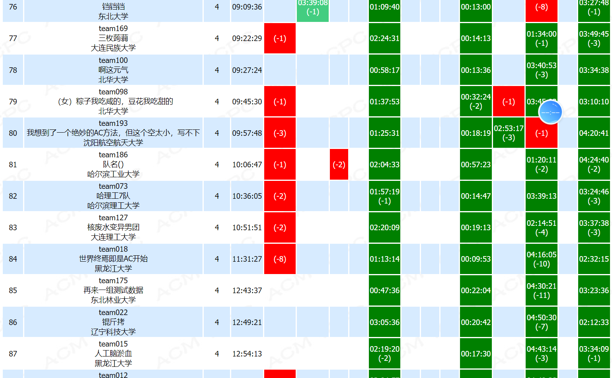

昨天刚打完东北地区 CCPC，因为马上要开始实习，所以基本上算是大学三年 ACM 生涯的最后一场比赛了。虽然被倒数第三题的数据类型卡了一小时而错失了夺银的机会，但是能和东大，哈工大这些强校的同学一同竞争，感觉三年的努力确实没有白费。从刚入学啥也不会的小白走到现在，也算是达到了对自己的要求，但是和正真的大佬还是有很大的差距，还是需要不断的学习。

前段时间投了一家区块链公司的实习，之所以没选择最熟悉的 Java 后端，可能是因为区块链这种新鲜事物对我的吸引更大吧。我一直坚信，**语言只是工具，真正重要的是数据结构，算法，计算机网络和操作系统这些计算机基础**，所以我决定尝试一下这个对我来说完全未知的领域。

比赛结束，实习单位确定，也终于能让一直紧绷着的神经放松一些，把好久不写的博客翻出来写一写。
